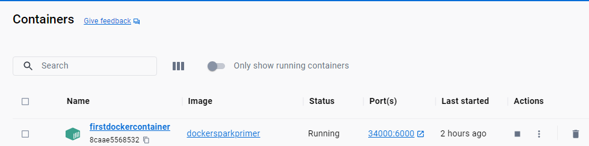
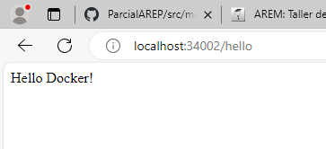
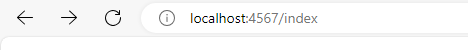
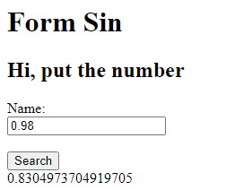
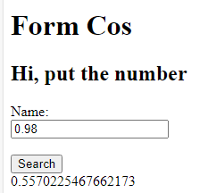
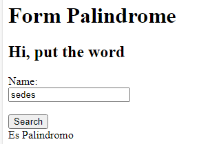
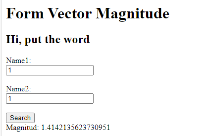

# Laboratorio Docket AREP
## Parte 1
Creacion de aplicacion Web con micro-framework Spark con construccion de Docker.

## ¿Qué se necesita para este laboratorio?
1. Git
2. DockerHub
3. Docker Desktop
3. Maven
4. Java

## ¿Como correr el Docker?
Para correr el Docker, lo ejecutamos con el siguiente comando:

    docker run -d -p 34000:6000 --name firstdockercontainer isaeme23/labarepdocker:latest

Dentro de este comando le hemos indicado que el puerto fisico en donde correra este servicio es en el puerto 34000
pero este puede ser modificado.

En su aplicacion de Docker Desktop se podra ve rla siguiente informacion:

Luego, podra ver en el puerto asignado la ejecucion del codigo presente en la imagen:

## Bono Parcial
Para ejecutar el codigo correspondiente, descargue este repositorio y ejecute el siguiente comando:

    java -cp "target/classes;target/dependency/*" com.arep.SparkWebServer

Luego, en su buscador busque la siguiente direccion:

Alli podra encontrar formas para los distintos metodos desarrollados usando Spark:

## Autor
Isabella Manrique
